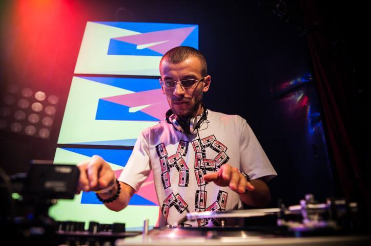
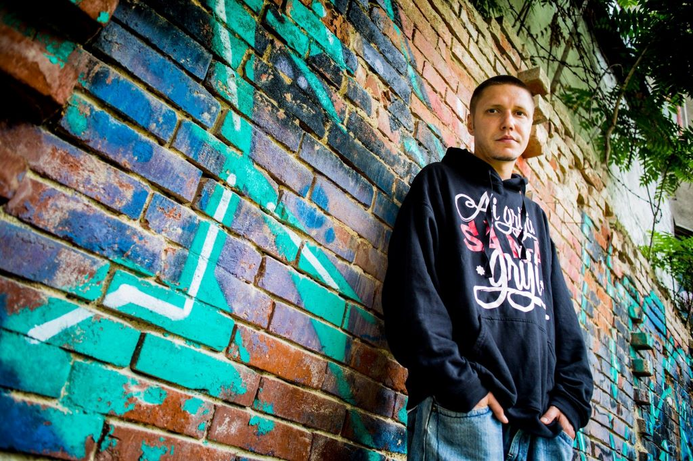
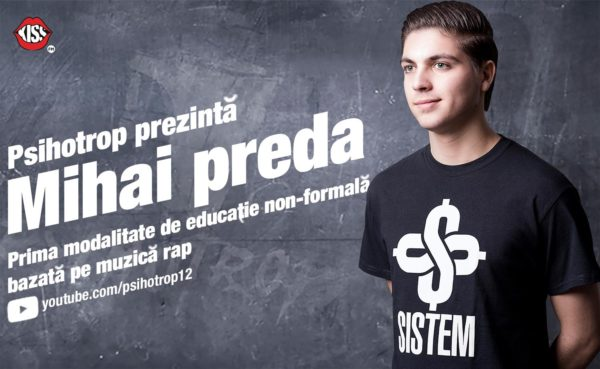

# Educatori Hip Hop in Romania

Vestea buna este ca in Romania exista deja initiative de educatie prin Hip Hop. Vestea mai putin buna este ca nu se vorbeste destul despre ele si ca nu exista inca o retea de colaborare intre activisti. Prin aceasta pagina vreau sa dau un impuls in aceasta directie.
O serie de artisti romani Hip Hop au si activitati educative derulate deja de mai multi ani. Sunt initiative proprii ale artistilor in cauza, partial in colaborare cu alti oameni din Hip Hop si s-au intamplat in context extra-scolar, vizand publicul tanar. 
Punctual exista si proiecte educative adresate special copiilor si adolescentilor. Mai jos descriu pe scurt initiativele pe care le-am putut gasi si care mi se par valoroase.

## DJ Undoo

DJ Undoo, respectiv Alexandru Damian Mihăilă (n. 1983) este un nume de referinta pentru Hip Hop-ul romanesc de mai bine de doua decenii. Pe lângă turntablism, producția muzicală si spectacole live, DJ Undoo este cunoscut pentru activitatile sale de predare și coaching. In 2009 a organizat primul atelier de turntablism din România, găzduit împreună cu comunitatea turntablism.ro. În 2013, DJ Undoo și Artskul au fondat theDJ.ro, primul și cel mai complet curs de mixare și turntablism din România. Șapte generații de studenți și-au făcut debutul pe scenă la petrecerile de absolvire în cluburi. Un nou curs este în lucru. Intre 2016-2019 a oferit „Ateliere de maiestrie” pentru grupuri de adolescent si studenți la evenimentul Ideo Ideis, in Alexandria. De asemenea, la diverse evenimente si festivaluri, a tinut ateliere de scratching.
[DJ Undoo Homepage](https://djundoo.ro/)

## Omu Gnom

Omu Gnom este rapper producator si scrie de cand se stie, asa ne explica pe pagina lui de artist. Face conscious rap, “adică rap care vorbește despre ființă cu tot ce are ea, cap-minte, inimă-suflet”. A lansat “cam 20 de albume” in cariera sa, “ceea ce nu e rău pentru visul unui copil venit dintr-un cartier mărginaș al capitalei”: Mulți sunt încă acolo, fă orice glumă vrei/Dar cum să ajungă tabăra undeva când toți stăteam în drumul ei? ((Omu Gnom ~ DJ Undoo – Visul unui copil). In 2016 Omu Gnom a conceput cursul de scris, ritm si teorie lirica A.R.T.A. (Atitudine, Răbdare, Tehnică, Ambiție), în care participanții explorează pe parcursul a 8 lectii teoria lirică, cu aplicabilitate directă în rap, elemente de bază ale ritmului, dicția corectă, atitudine și scris. Cursul s-a derulat mai multi ani la rand iar despre ce se invata acolo, Gnom zice: “O sa invete sa gandeasca in rime si, mai mult, o sa invete sa fie oameni intre ei. Sa fie o echipa. La cursuri nu vorbim doar de scris, vorbim si despre viata si univers si invatam unii de la altii.“ In fiecare joi seara face emisiune “Muzică de pus pe gânduri” Radio Guerrilla. 
[Omu Gnom Homepage](https://www.omugnom.com)

## Psihotrop

Tanarul artist Psihotrop si comentariile sale in format rap ale operelor literare pentru bacalaureat au fost o senzatie intre 2017- 2019
[Psihotrop Homepage](https://psihotrop.ro/)

## Proiectul “Flori De Ghetou” (2021)

Proiectul “Flori De Ghetou” a oferit in 2022 copiilor din 2 centre de plasament din Cluj-Napoca o experienta autentica a culturii Hip Hop printr-o serie de workshop-uri, in special de dans.

[Flori de Ghetou pe Facebook](https://www.facebook.com/FloriDeGhetou)

## Activitatile pedagogice ale rapper-ului Cedry2k in scoli si licee

Din comentariile de pe YouTube la unele din piesele rapper-ului Cedry2k, se deduce faptul ca unii profesori de religie se foloses de piesele de rap ale acestuia. Cedry2K, care a avut numeroase activitati pedagogice in diverse licee din tara, in care a discutat cu elevii despre atitudinea sa fata de politica, droguri, societate etc. In cele mai multe cazuri accesul catre scoli a fost facut de asociatii diverse de studenti in Teologie. De altfel, Cedry2k este pana la ora actuala singurul rapper despre care exista un articol stiintific scris de o cercetatoare din Romania, institutlat: 

## Noul val de scoli si cursuri de dans (breaking) din Romania

Interesant si important de stiut este si faptul ca in Romania exista un adevarat val de scoli de dans Hip Hop pentru copii si tineri.

