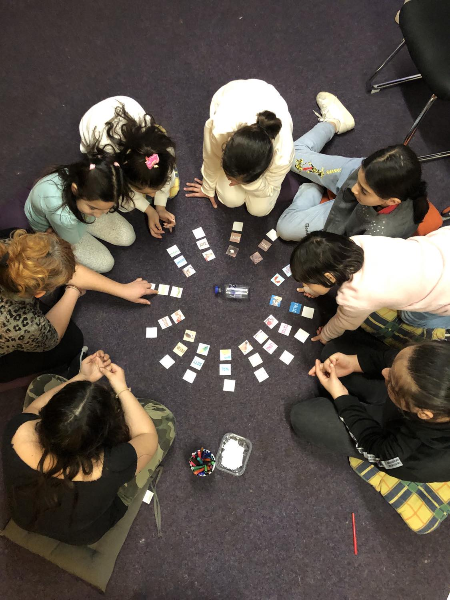
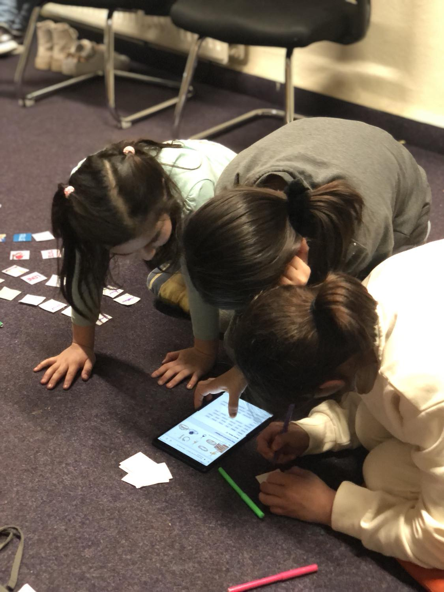

# Metode didactice. Exemple de proiecte din munca mea

Fiind un [domeniu]() relativ recent, nu exista manuale standardizate cu metode didactice specifice pedagogiei Hip Hop. Pe de alta parte, in literatura de specialitate incep sa apara lucrari care colecteaza cele mai bune practici, metode si exemple de proiecte. In practica, pedagogii care sunt familiarizati intr-o oarecare masura cu ceea ce inseamna Hip Hop-ul, poate pentru ca ei insisi sunt consumatori ai culturii, gasesc metodele potrivite in lucrul cu tinerii, in limita creativitatii proprii si a resurselor care le stau la dispozitie. 

## Atelier de Hip Hop cu elevi din scoala primara (2024)

Intr-un alt proiect in care lucrez cu copii sub 12 ani, am organizat un atelier de Hip Hop de 2 zile cu un program divers: o introducere in istoria Hip Hop-ului printr-un film documentar, exercitii si jocuri de dictie, jocuri in echipa de gasit rime potrivite, jocuri de echipa, exercitii de body acoustic si exercitii de dans, discutie in grup despre piesele rap preferate ale copiilor.
- [Poze de la atelier](atelier-hip-hop24.md)

## Slam poem (lirica) intr-un proiect de preventie cu elevi din scoala primara (2024)

Intr-un proiect de preventie in care lucrez cu elevi dintr-un cartier vulnerabil din Berlin, am compus in 2023 impreuna cu participantii la proiect, elevi din clasa a 6-a, o poezie (slam poem) despre situatia de viata din cartierul lor, despre problemele de acolo dar si despre lucrurile frumoase din cartier, din perspectiva copiilor. In prealabil am purtat mai multe discutii interesante, in care copiii au reflectat despre probleme si solutii pentru viata lor in cartier. Poezia a fost transmisa catre scoala lor, catre primarie si alti actori locali, lucrul acesta a condus la colaborari noi. Poza slam poem Spandau
  
In acest fel au fost antrenate mai multe competente sociale: munca in echipa, spiritul de cooperare, abilitati de comunicare, increderea in fortele proprii, rabdare si concentrare, precum si alte abilitati, cum ar fi cele lingvistice, sportive, muzicale si tehnologice (la jocul de gasit rime copiii au lucrat independent cu tablete si cu o pagina de internet cu rime). La toate acestea se adauga buna dispozitie in care au lucrat copii si emotiile pozitive pe care le-au luat cu ei acasa. POZA Reimenübung Lichtenberg

## Atelier de rap cu adolescenti si LMNZ, rapper/producator (2021)

bdsDBJSBASS

## Atelier de rap cu copii din scoala primara cu Leila, rapper (2018)

cssadssa

## Cateva ganduri despre pedagogul Hip Hop

Conceptul de pedagogie Hip Hop nu este insa pentru oricine. Este binevenit ori “indicat” ca pedagogul in cauza dispune de resurse personale cum ar fi: creativitate, motivatia de a include educatia culturala in modul de predare, o minte deschisa, curajoasa sa adreseze si subiecte considerate tabu in curricula scolara, deschiderea fata un de un limbaj colocvial (pastrand bineinteles formele de politete din scoala).

Privind Pledez pentru o integrare a pedagogiei Hip Hop in mediul educational din Romania
Pedagogia Hip Hop este un concept transformative si in cee ace priveste relatia elev-profesor.

- [Atelier hip hip in scoala primara](atelier-scoala-primara.md)
